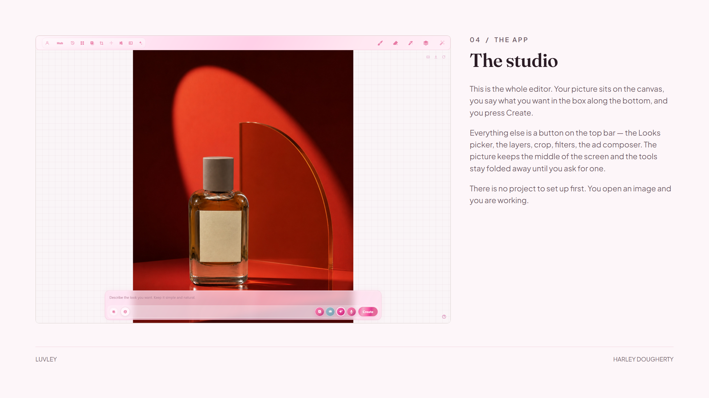
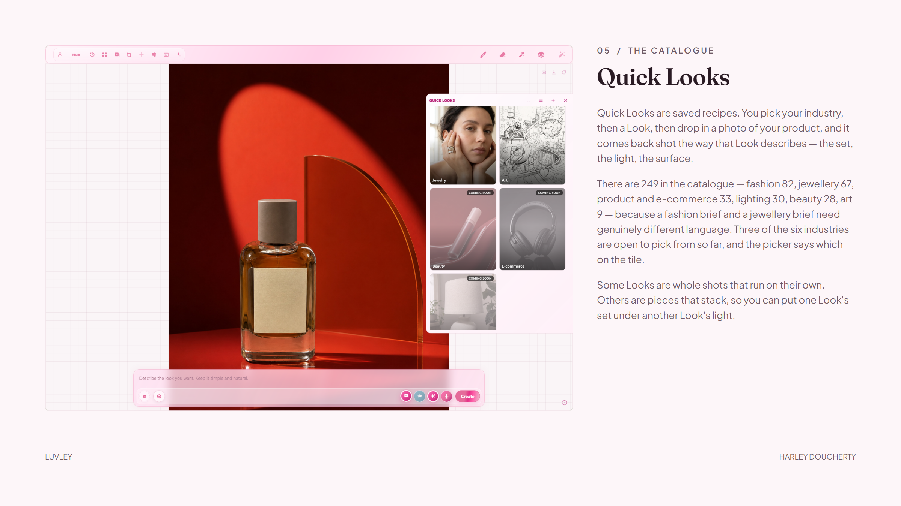
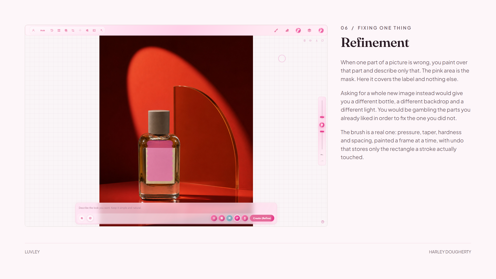
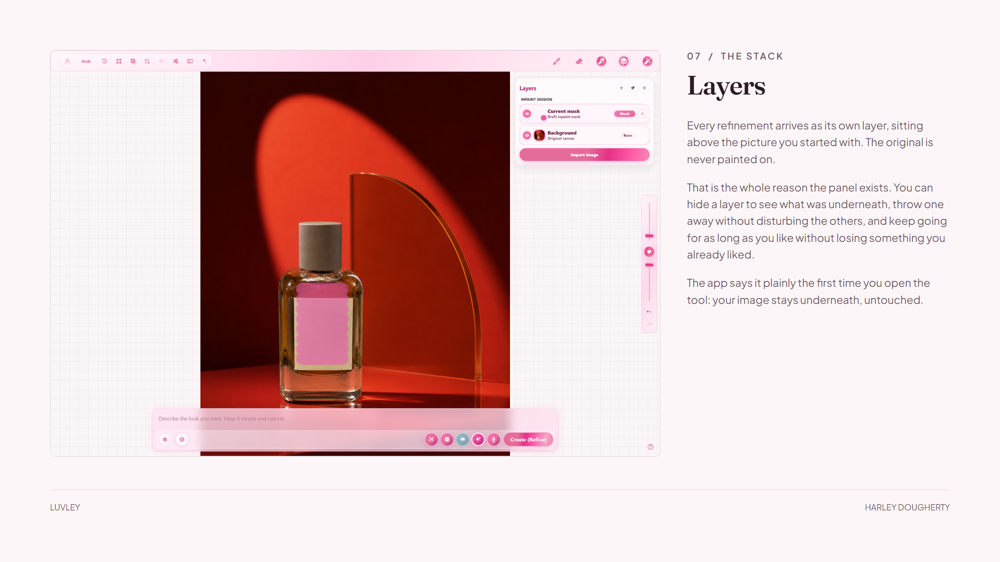
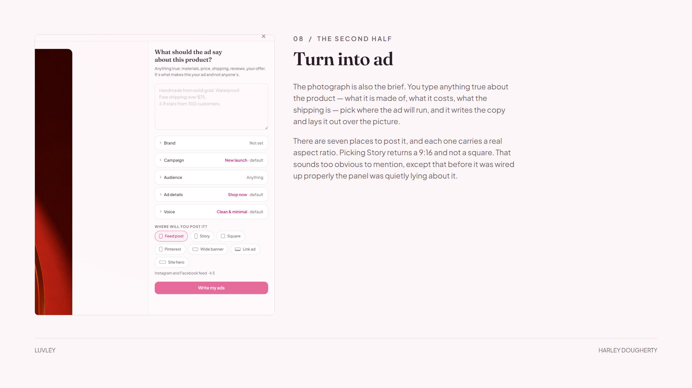
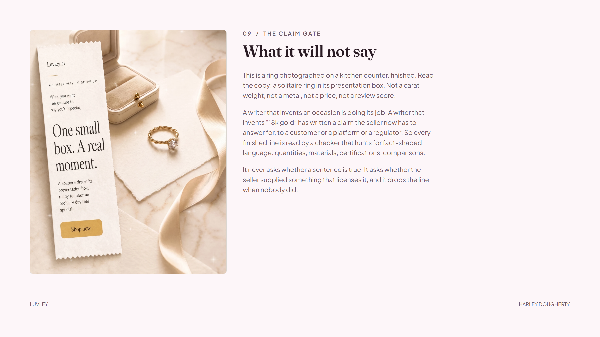
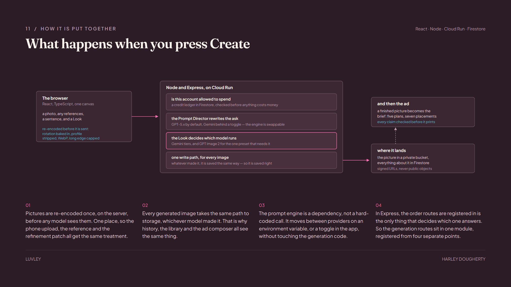
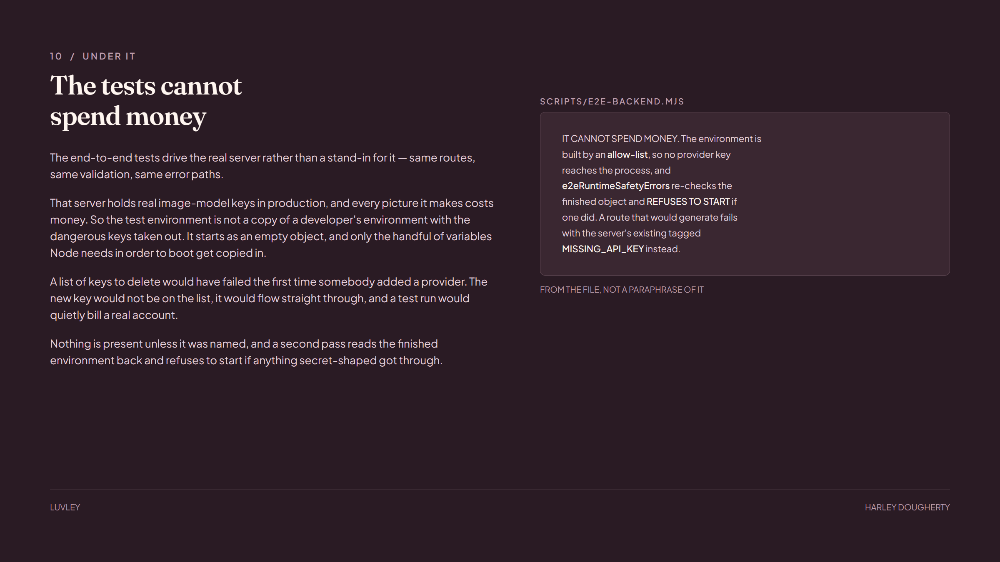

# Luvley

A web studio for people who sell things and cannot afford a photographer.

Open a photo you took on your phone — a ring on the kitchen table, a bag on the carpet —
pick a Look, and it comes back shot the way that Look describes: the set, the surface, the
light. The product itself has to survive the trip unchanged. That is the hard half.

Live at **[luvley.ai](https://luvley.ai)**. It meters every picture against a credit ledger
and takes card payments. I built all of it — the editor, the painting canvas, the prompt
catalogue, the server, the billing, and the agent tooling I used to work on it.

## A phone photo goes in

## The studio

Everything happens on one canvas. The image is the hero; the tools sit beside it rather than
on top of it.

## Quick Looks

249 saved recipes across six industries, because a fashion brief and a jewellery brief need
genuinely different language. Some run alone. Others stack.

## Refinement

When one part of a picture is wrong, you paint a mask over that part and describe only that.
Asking for a whole new image instead would give you a different bottle, a different backdrop
and a different light — you would be gambling the parts you liked to fix the one you did not.

The brush is a real one: pressure, taper, hardness and spacing, painted a frame at a time,
with undo that stores only the rectangle a stroke actually touched.

Every refinement lands as its own layer above the original, which is never painted on.

## Turn Into Ad

A finished picture becomes the brief. The planner reads the image, proposes five directions,
and lays each one out for a real placement — seven of them, each with the aspect ratio the
platform actually wants.

### What it will not say

The ad writer may invent a customer or an occasion. It may not invent a material, a
certification, a price or a result. A checker reads every finished line for fact-shaped
language and asks — not whether the sentence is true, but whether the seller supplied
anything that licenses it. If nobody did, the line is dropped.

## How it is put together

## The tests cannot spend money

The end-to-end tests drive the real server, and that server holds real image-model keys in
production. So the test environment is not a copy of a developer's environment with the
dangerous keys removed — it starts as an empty object, and only the handful of variables Node
needs to boot are copied in.

A list of keys to *delete* would have failed the first time somebody added a provider: the new
key would not be on the list, it would flow straight through, and a test run would quietly bill
a real account.

## Code

The product is commercial, so the application source stays private. These five modules are
self-contained and are the ones worth reading:

| File | What it is |
| --- | --- |
| [`inpaintBrushMath.ts`](code/inpaintBrushMath.ts) | Pressure, taper, hardness and spacing — the arithmetic behind the brush |
| [`inpaintRectMath.ts`](code/inpaintRectMath.ts) | The dirty-rectangle algebra that makes undo cheap |
| [`route-table-fingerprint.mjs`](code/route-table-fingerprint.mjs) | Boots the real server, walks the router in order and hashes every handler — how a 5,300-line file was split into fifteen pieces and *proved* unchanged |
| [`fleet.mjs`](code/fleet.mjs) | The orchestrator I built to run coding agents in parallel, one per isolated worktree. Its header comment is the design document |
| [`ui-evidence.mjs`](code/ui-evidence.mjs) | Renders before/after evidence sheets, and exits non-zero if a row proves nothing |

## Built with

React 18 · TypeScript · Vite · Canvas 2D and Pointer Events · Node · Express · sharp ·
Firestore · Cloud Run · Stripe · Google Gemini and OpenAI image models · Playwright

---

The screenshots are the real editor. The pictures are real output from it.
